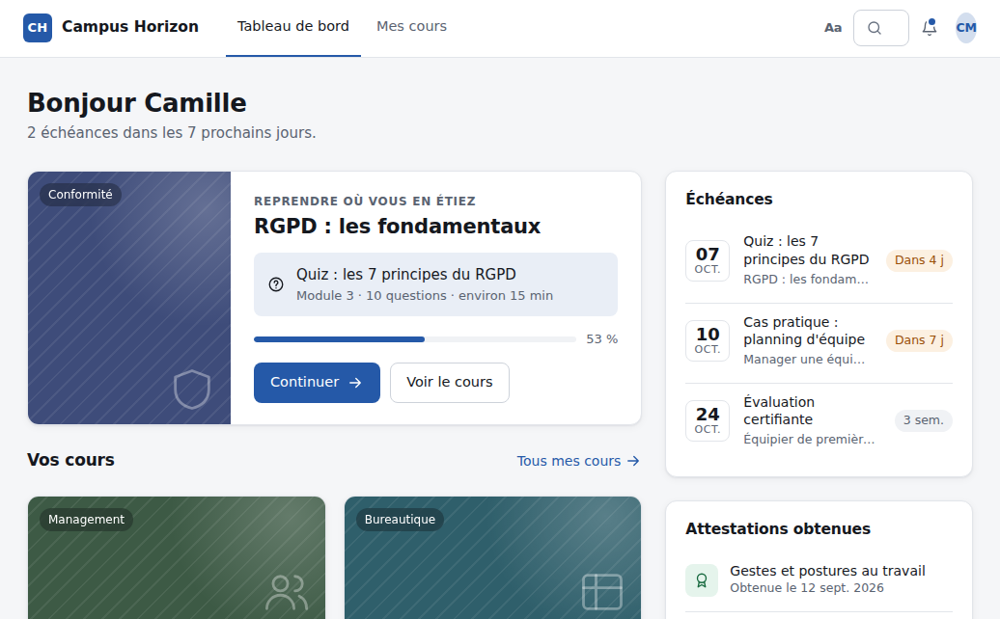

# Épure

A modern, clean and accessible Moodle theme for **Moodle 4.5 LTS and 5.x**, with or without **IOMAD**.

Documentation: [English (theme README)](theme/epure/README.md) · [Français (wiki)](https://github.com/ericfalcon/moodle-theme-iomad/wiki) · [README en français](theme/epure/README.fr.md)

## Repository contents

| Folder | Component | Role |
|---|---|---|
| [`theme/epure`](theme/epure) | `theme_epure` | The theme: appearance, accessibility, vocabulary, IOMAD integration |
| [`docs/wiki`](docs/wiki) | — | Sources of the French wiki pages |

Copy `theme/epure` into the `theme` folder of your Moodle site (`public/theme` from Moodle 5.1 onwards), or install the ZIP file from Site administration › Plugins › Install plugins: download `theme_epure-x.y.z.zip` from the Assets of the latest [release](https://github.com/ericfalcon/moodle-theme-iomad/releases), not the « Source code » archives that GitHub adds to every release (they hold the whole repository, which Moodle does not recognise as a theme). IOMAD is detected automatically: there is no other plugin to install.

If you installed the "Épure tools" plugin (`local_epure`) of versions 0.1 to 0.3: first upgrade the theme (it takes over your vocabulary settings), then uninstall that plugin.

The roadmap and design decisions (in French) are in [ROADMAP.md](ROADMAP.md); the changes of each version in [CHANGES.md](CHANGES.md).

## Compatibility

Moodle 4.5 LTS to 5.3, PHP 8.1 to 8.4, with or without IOMAD, on PostgreSQL, MariaDB or MySQL (the theme only uses Moodle's database API). Every change is checked by continuous integration on Moodle 4.5, 5.0, 5.1, 5.2 and 5.3 with PostgreSQL, and on Moodle 4.5 and 5.3 with MariaDB 11.4 (PHPUnit, Behat with an axe-core accessibility audit, code checks). MySQL is not tested separately.

## Licence

GNU GPL v3 or later, like Moodle. See [LICENSE](LICENSE). The bundled fonts are under the SIL Open Font License 1.1.
